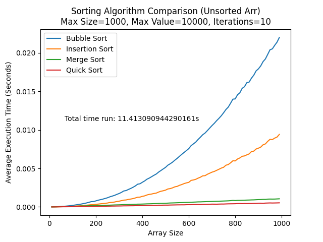
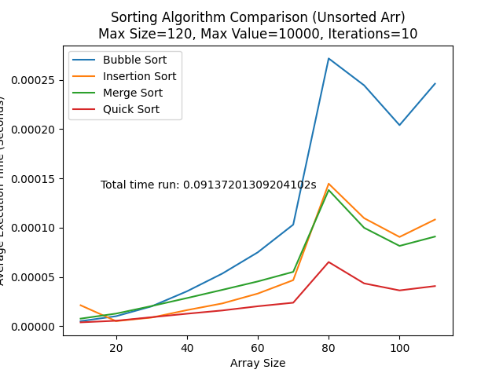
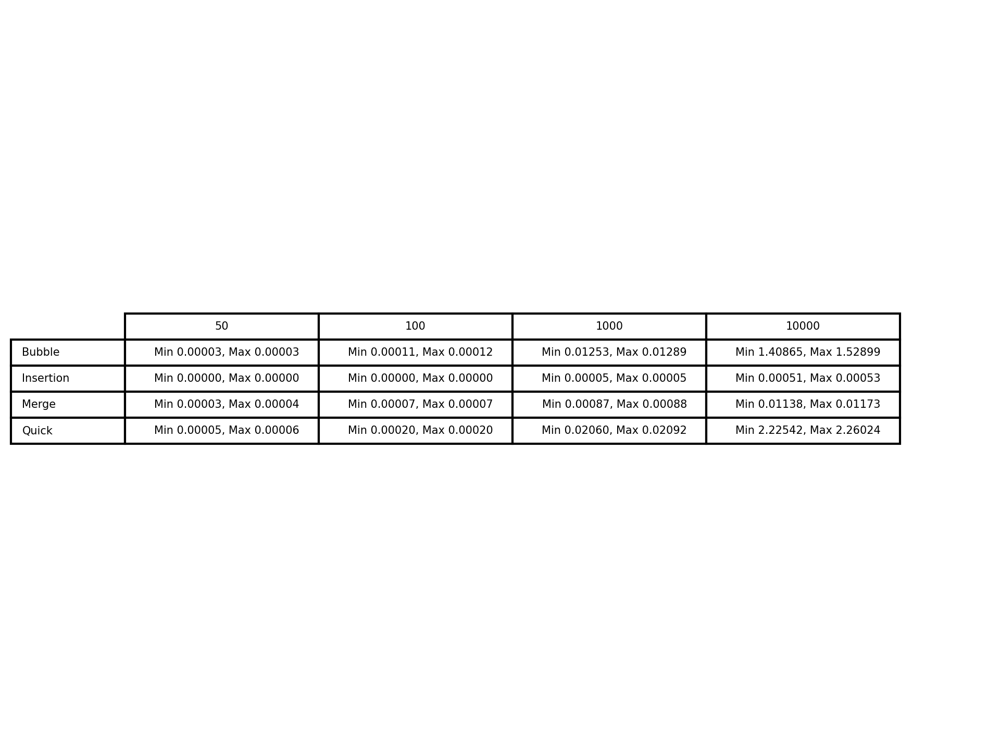
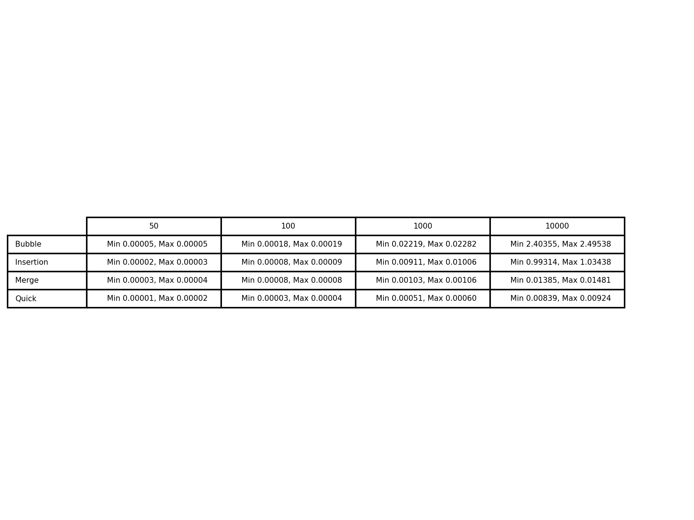

# Sorting Algorithm Comparison

Parameters for the comparison:

### `max_size`
The maximum size of the arrays to be sorted.
### `max_value`
The maximum value of each element in the arrays.
### `num_iterations`
The number of iterations to run for each array size.
### `test_sizes`
The list of sizes of the sorted arrays.

## Performance on Unsorted Arrays

This code measures and compares the average execution times of different sorting algorithms using randomly generated arrays. The sorting algorithms included in this comparison are Bubble Sort, Insertion Sort, Merge Sort, and Quick Sort. The code will plot the average running time per array for each sorting algorithms.

*This graph illustrates the comparison for randomly generated arrays with sizes ranging up to 1,000 and maximum value of 10,000. Each array size is iterated 10 times.*

*This graph illustrates the comparison for randomly generated arrays with sizes ranging up to 120 and maximum value of 10,000. Each array size is iterated 10 times. We can see that for array sizes below 30, Merge Sort takes longer than Bubble Sort. For array sizes ranging from 20 to approximately 75, Merge Sort takes longer than Insertion Sort.*

## Best/Worst performance on Already Sorted Arrays

This code measures and compares the performance of different sorting algorithms on already sorted arrays. The sorting algorithms included in this comparison are Bubble Sort, Insertion Sort, Merge Sort, and Quick Sort. The code will create a table the minimum and maximum execution time for each sorting algorithm across different array sizes.

*This table illustrates the best and worst performance of sorting algorithms when it comes to already sorted arrays of size 50, 100, 1,000, and 10,000. We can see that for already sorted arrays, Quick Sort has the longest sorting time, followed by Bubble Sort and Merge Sort. Insertion Sort takes the shortest amount of time.*

## Best/Worst performance on Unsorted Arrays

This code performs a performance analysis of four sorting algorithms: Bubble Sort, Insertion Sort, Merge Sort, and Quick Sort. It measures the execution time for each algorithm on different test sizes of arrays and generates a table showing the minimum and maximum execution times.

*This table illustrates the best and worst performance of sorting algorithms on unsorted arrays of size 50, 100, 1,000, and 10,000.*